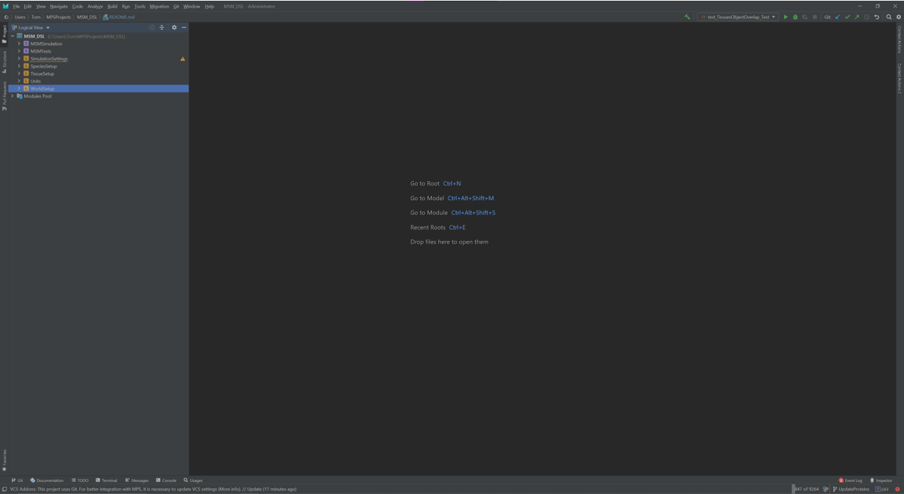
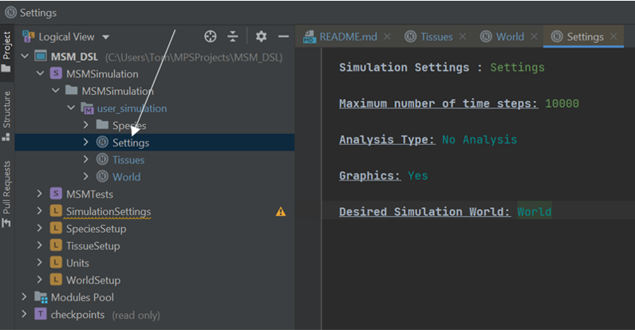
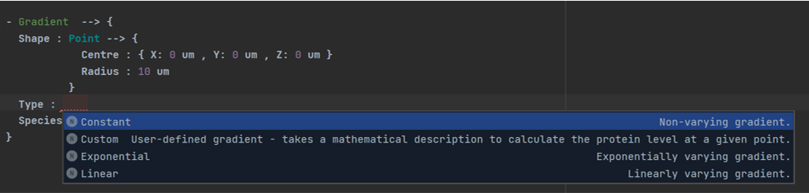
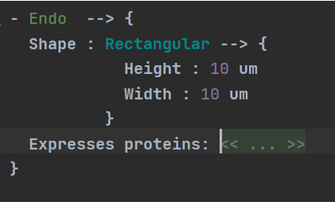
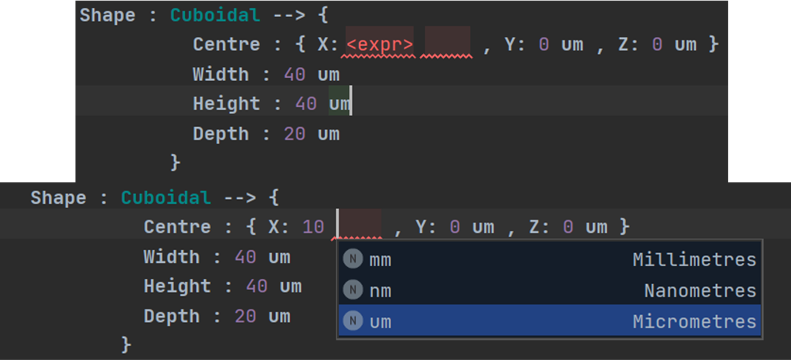

MSM-DSL: A Domain-Specific Language For Shape-Signalling Feedback Modelling
========================================================================

Description
-----------

The MemAgent Spring Model - Domain Specific Language (MSM-DSL) is a domain specific language designed to enable experimental and computational biologists to interact with and extend the capabilities of the MemAgent-Spring model. 
The approach of the DSL is to translate concepts used to describe a biological system into C++ code, which is then integrated with the core MSM codebase. 
MPS is the tool used to create concepts which constitute the language and define rules to translate them into code - and can also be used to run the new version of the MSM created by a user.

The MSM-DSL currently consists of four main sub-languages that describe various aspects of creating a simulation using the MSM; the Tissue-Setup language, the World-Setup language, the Species-Setup language (under development) and the Simulation-Setting language. 
Other ancillary languages, such as a language which supports different physical units for quantities defined by a user, are also included. 
When setting out to build a new simulation, users need to interact with each sub-language in sequence to completely describe the system in question. 
More details on each individual language and the concepts that belong to them can be found under their associated subsections in this document.

Installation
-----------

For installation instructions, please refer to the appropriate links for operating system specific guides:

-----
-   [MacOS](docs/install/MAC_INSTALLATION.md) 
-   [Linux](docs/install/LINUX_INSTALLATION.md) (WIP)
-   [Windows](docs/install/MAC_INSTALLATION.md) (WIP)

-----

Language Summaries
-----

Information on each of the sub-languages in the DSL, including descriptions for all available concepts, can be found below:

-----
-   [Tissue Language](docs/lang/TISSUE_LANG.md)
-   [World Language](docs/lang/WORLD_LANG.md)
-   [Species Language](docs/lang/SPECIES_LANG.md)
-   [Settings Language](docs/lang/SETTINGS_LANG.md)

-----

General Usage
-----
Upon downloading the MSM-DSL and opening the repository which contains it in MPS, users will be greeted with the MPS interface. 
While initially intimidating for newcomers, creating a new MSM simulation only requires the user to interact with a small aspect of the interface.  

In the above screenshot, one can see an overall view of the DSL “project” in the leftmost window. 
There are seven visible components to the project; five language components (designated by the yellow square with an “L”) which contain the various concepts needed to describe the simulation, and two “solution” components (designated by the purple square with an “S”).

To begin creating a new simulation, double-click on "Settings", underneath the MSM “solution” component. 
This will take you to a window which shows the various parameters one can adjust when creating a simulation.

Some aspects of the language can be edited freely, such as the names of cell types. 
Others come with a pre-defined range of options, such as the analysis type in the settings. 
In order to see which options an aspect has (if any), you can delete the entry for the aspect and press “Ctrl + Space” (Windows/Linux) or “Control + Space” (Mac) to see those options.
If you get stuck at any point using the DSL, this should be the first thing you try!

In other cases, you can click on any area marked with "<<...>>" and press "Enter" in order to add in the associated concept at that point. 
For example, clicking and entering on the marked area next to the Species field lets you pick a species to use in a gradient.

Distances use two fields; one field that takes in a distance value and a second that provides a dropdown box to pick the units. 
For example, to write "10 um", first click on the first field and type "10", then press tab to switch to the unit field.
Pressing control space lets you pick the exact unit to be used - in our case, we want "um". Typing "um" does the same thing.

In order to run the simulation - follow these steps:

1. Check that you've updated the world boundaries and species interactions!
2. Rebuild the project. To do this, click on "Build > Rebuild Project".
3. Click "Run > MakeAndRun". This will copy the generated code files, create a new simulation using the existing MSM code, which is then run.

Tests
-----

(WIP - to be handled at MPS and C++ level)

Tests for DSL functionality are currently included in the MSMTests solution. It is advised for users who are unfamiliar
with MPS and unit testing in general to leave the tests alone, as there is the potential for unsafe (i.e. capable of deleting the MSM code elsewhere)
code to be written in these tests.

Contributing
------------

(WIP)