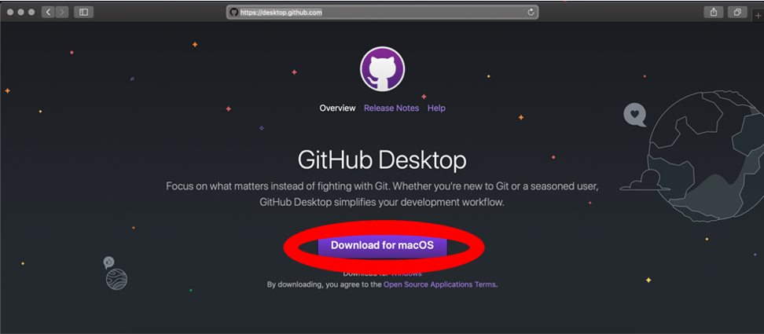
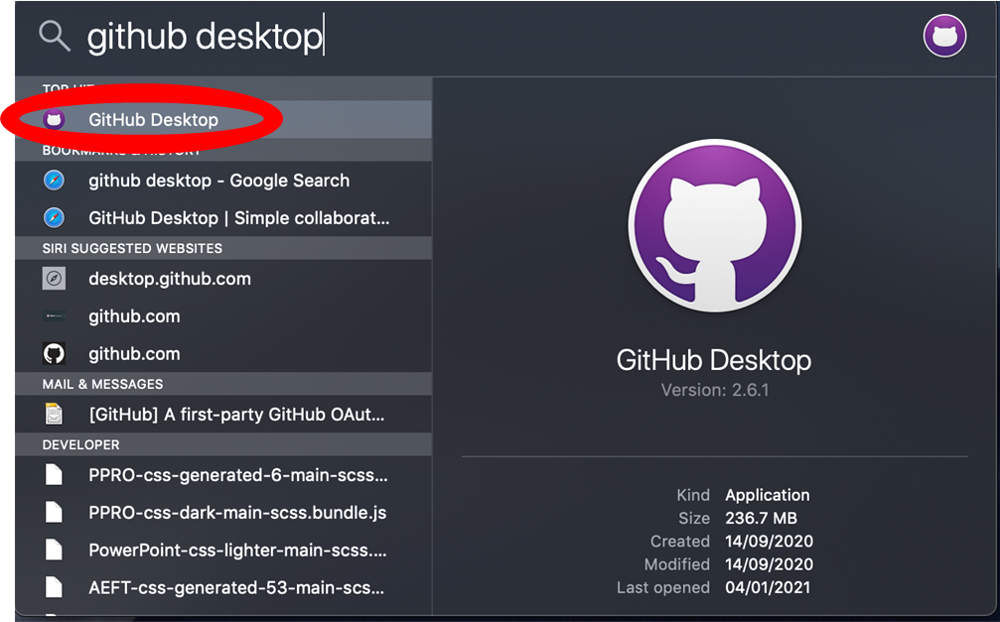
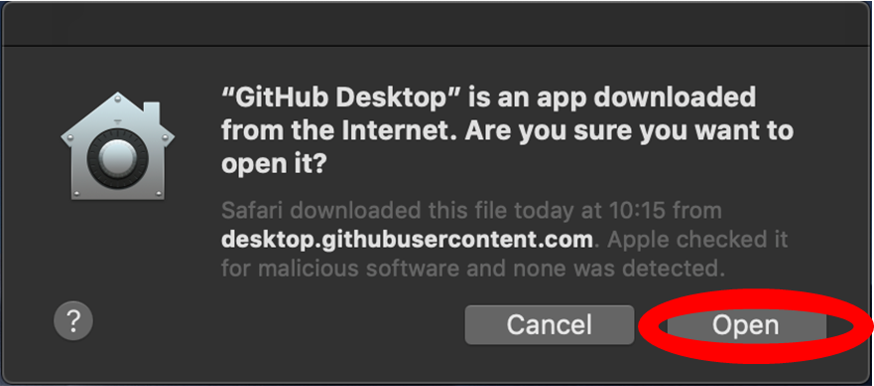
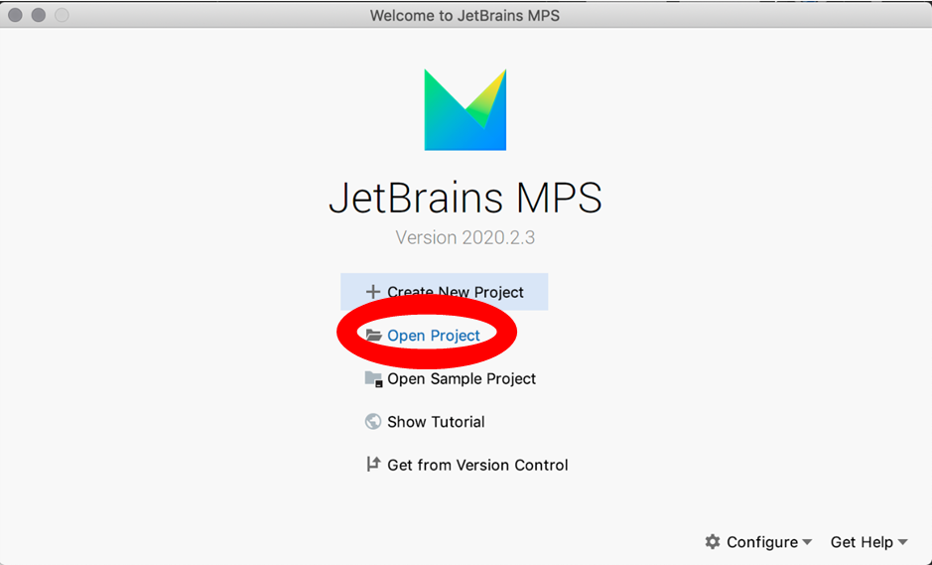

How to install the MSM-DSL on MacOS
========================================================================

Step 1: Install Github Desktop
-----------

-	Go to https://desktop.github.com.  
     
-   Press the purple “Download for MacOS” button.
-  	Press “Command + Spacebar" on your keyboard to bring up the Spotlight Search, once the download is complete.  
     
-   Type “Github Desktop” and choose the first option that appears.
-	Click “Open” on the warning prompt that appears.
     
-	Move the Github Desktop application (which is currently located in your Downloads folder) to your Applications folder.

Step 2: Download the MSM-DSL Repository
-----------

-	Create a Github account, if you have not already got one: https://github.com/join?source=login.
-	Go to the following repository: https://github.com/meadt/MSM_DSL. (Note: you must be logged in to Github for the link to work. If you are logged in and the link still doesn’t work, you may not have access to this repository, please contact me for access).
-	On the webpage for the repository, press the code button and press open with Github Desktop.
     
-	Press the “Clone” button in the window that pops up in Github Desktop. Note the “Local Path” of the repository - this is where the DSL code will be located after the download.
     

Step 3: Install MPS
-----------

-	Go to https://www.jetbrains.com/mps/ and press the blue “Download” button.
     
-	Once the next page has loaded, click the blue “Download” button for Mac (which should have been detected automatically).
     
-	Open the downloads tab in Safari and click on the .dmg file that has just been downloaded.
-   Click and drag the icon into the applications folder.
    
- 	Open MPS and click on the Open Project button. (You may have to configure MPS settings at this stage, it is fine to leave everything on its default settings).
-	Navigate to the location of the downloaded MSM-DSL repository and open it within MPS.
     

Step 4: Configure MPS
-----------

-	Click on the “MPS” icon in the top left of the screen and navigate to “Preferences”. Alternatively, press “Command” + “,” to open the Preferences window.
-   Click on the “Plugins” tab on the left and search for “plaintextgen”. Press install on the “plaintextegen” button.
    
-   Next, go to "Preferences > Build, Execution, Deployment > Global Libraries".
-   Click on the add "Add" button in the bottom left of the "Global Plugins" window. Type in any name you wish in the box that appears - here, I've chosen "Plugins".
      
    
-   Navigate to the main MSM-DSL directory on your system - select the "Plugins" folder. If successful, you should see the path to that directory associated with the name you chose earlier.
-   Leave the "Global Libraries" window, then select "Build > Rebuild Project" along the top of the screen. This should configure the DSL to use the plugins specified earlier.
    
-   If there are no errors, then the DSL is ready to use!