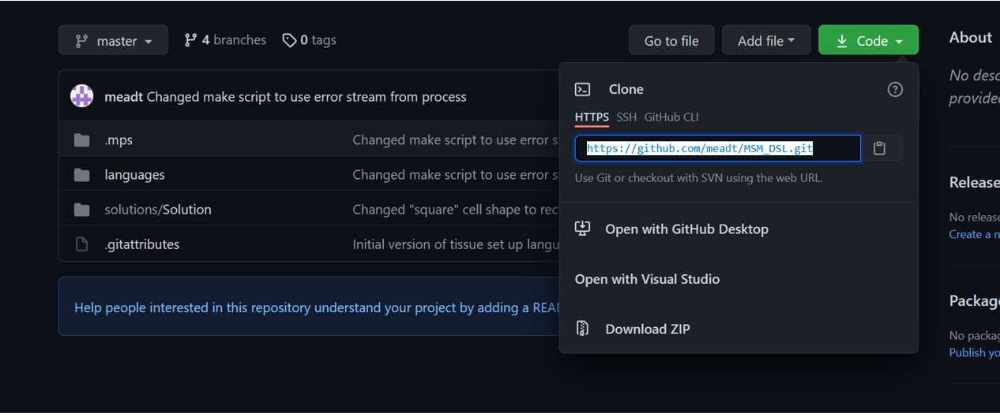

How to install the MSM-DSL on MacOS
========================================================================

Step 1: Install MPS
-----------

-	Go to https://www.jetbrains.com/mps/ and press the blue “Download” button.
     

     

-	Once the next page has loaded, click the blue “Download” button for Mac (which should have been detected automatically).
     

     

-	Open the downloads tab in Safari and click on the .dmg file that has just been downloaded.
     

-   Click and drag the icon into the applications folder.

Step 2: Install MPS
-----------

- 	Open MPS and click on the Open Project button. (You may have to configure MPS settings at this stage, it is fine to leave everything on its default settings).

-	Click on "Get From VCS".
     

-   Enter your Github login details, if prompted.   
    

-   Navigate to the following repository : https://github.com/meadt/MSM_DSL. If this link doesn't work, please email to ensure that you have access.

-   Click on the green "Code" button and copy the URL : https:://github.com/meat/MSM_DSL.git.

-   In MPS, paste this URL into the "URL" field, and then press the blue "Clone" button.

Step 2: Configure MPS
-----------

-	Click on the “MPS” icon in the top left of the screen and navigate to “Preferences”. Alternatively, press “Command” + “,” to open the Preferences window.

-   Click on the “Plugins” tab on the left and search for “plaintextgen”. Press install on the “plaintextegen” button.
    

-   Next, go to "Preferences > Build, Execution, Deployment > Global Libraries".

-   Click on the add "Add" button in the bottom left of the "Global Plugins" window. Type in any name you wish in the box that appears - here, I've chosen "Plugins".
    

  

-   Navigate to the main MSM-DSL directory on your system - select the "Plugins" folder. If successful, you should see the path to that directory associated with the name you chose earlier.

-   Leave the "Global Libraries" window, then select "Build > Rebuild Project" along the top of the screen. This should configure the DSL to use the plugins specified earlier.

-   If there are no errors, then the DSL is ready to use!