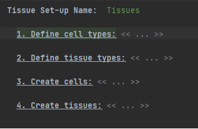
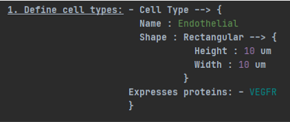
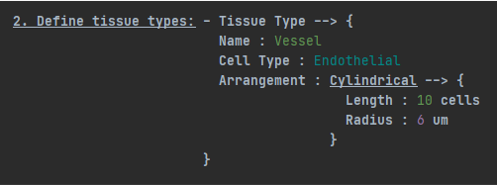
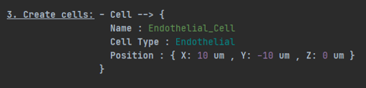
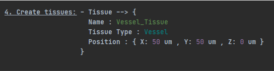

Cell and Tissue Creation Language
========================================================================

Overview
-----------

-	The MSM-DSL allows users to define and create cells and tissues in their simulation. Tissues and cells can be created by opening a new instance of a "Tissue Container". Once a user does so, they will see the following: 

-   Providing a name to a tissue container allows a user to track individual configurations of tissues, which lets them "mix and match" different tissue and world configurations easily.

-   Because cell types are required for cells and tissue types, and tissue types are needed for tissues, it is recommended to create your new configuration following the order specified in the container i.e. _Cell Types -> Tissue Types -> Cells -> Tissues_.

-   The above is an example cell type, which requires a name ("endothelial"), shape as well as any proteins/species that it expresses. Species, as well as their interactions and behaviour, are defined in the species container.

-   Here, a new tissue type corresponding to a vessel has been created. As can be seen, the tissue type takes in a previously defined cell type which will form the basis of the new tissue when the simulation begins.

-   As with cell types, tissue types need a name, but  also an arrangement, which describes the organisation of the constitutent cells in space.

-   Once cell and tissue types have been defined, they can be placed in the simulation world. Cells require a name and position, which is defined using relative distances.

-   Likewise, tissues can also be placed in the world using relative distances, after giving them a name.

Concepts
-----------

-	**_Arrangement:_** A description of how **cells** within a **tissue** are arranged in space.

-	**_Cell Type:_** A concept to track the properties and behaviour of a type of **cell**, which is used when a **cell** is created. Requires a name and **shape** to be defined. Cell types also track which **species** they express.

-	**_Cell:_** Tracks the properties and location of a **cell** in the simulation. Requires a name, **cell type** and a **position** to be defined. **Cells** can currently only be placed level with the X and Y axes (i.e. Z remaining constant).

-   **_Cylindrical (Arrangement):_** A type of **arrangement**, which creates a **tissue** in the shape of a hollow cylinder. The cylinder radius is defined using a distance and the length in **cells**. The number of **cells** along the circumference is determined automatically using the defined radius and the height of the **cells** making up the tissue. Cylindrical **tissues** can currently only be placed lengthwise along the X-axis of the simulation.

-	**_Flat (Arrangement):_** A type of **arrangement**, which creates a two-dimensional, rectangular **tissue**. Has both height and width described in number of **cells** (which must be positive, whole numbers). Flat tissues can currently only be placed level with the X and Y axes (i.e. Z remaining constant).

-	**_Position:_** Describes the location of the centre of **cells** and **tissues** in the simulation, using distances relative to an abstract origin point. Coordinates can therefore be positive or negative.

-	**_Shape:_** Describes the shape of a **cell** and is stored by the associated **cell type**.

-	**_Rectangular (Shape):_** A type of **cell** shape, which forms a 2D, rectangular **cell**. Has both a height and width described in distances (which must be positive, whole numbers).

-	**_Tissue Type:_** A concept to track the properties of a type of **tissue**, which is then used when a particular **tissue** is created. Requires a name, **arrangement** and **cell type** to be defined.

-	**_Tissue:_** Tracks the properties and location of a **tissue** in the simulation. Requires a name, **cell type** and a **position** to be defined.

-	**_Tissue Container:_** A concept that stores **cells** and **tissues**, as well as the **cell types** and **tissue types** associated with them. Users interact with the tissue container when describing the layout of their experiment.
