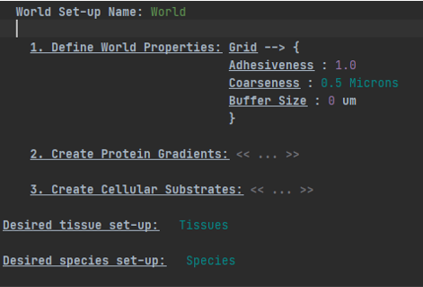
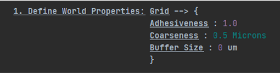
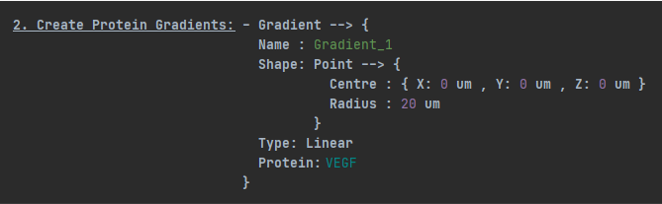
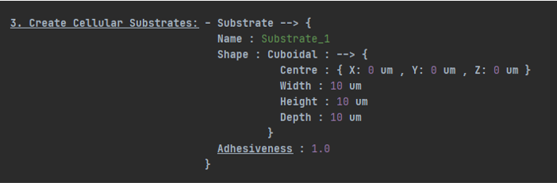

World Creation Language
========================================================================

Overview
-----------

-   Using the world creation language, a user can create a simulation environment for cells and tissues to interact in. More specifically, a variety of environmental properties of potential interest to a biologist, such as protein gradients or substrates with differential adhesion properties.

-   To begin altering the simulation world, a user can create a world container, which can then have protein gradients and substrates added to it.

-   Users must define a name for the world container, which allows them to create multiple configurations and switch between them, as well as the species and tissue containers that they wish to use.

-   The "grid" is the first aspect of the world container that users should experiment with. The grid describes the base level of adhesiveness for the world, as well as the coarseness of the 3-dimensional grid used to perform the simulation (a distance of 0.5 microns between each point in the 3D grid). A world will always have a grid created for it.

-   Protein gradients can also be placed in the world by a user - these utilise a "species" that correspond to a protein or other component of a gene regulatory network to create signals that cells respond to. Multiple gradients can be placed in the world, and have different shapes (such as point or cuboidal)

Concepts
-----------

-	Adhesiveness: A property owned by instances of the simulation world or individual substrates, which affects the probability that a cell can lay down a focal adhesion in a given region of space. Takes a value between 0 and 1.
     

-	Gradient: A concept used to describe a protein gradient within the simulation world. A gradient requires a name, a protein/species (which must have its position set as extracellular), a type and a shape.  Applying multiple gradients with the same protein to the same area causes them to sum up.

-	Grid: Used to describe properties of the simulation environment, such as the X, Y and Z dimensions, as well as the base level of adhesiveness of the environment. 

-	Shape (Gradient): Describes the area that the gradient acts over. Gradients can currently act in either a cuboidal area, originate from a point source (therefore forming a sphere) or they can be defined using gradient sources and sinks, which denote the boundary of the gradient. If the location of the sink relative to the source changes along any axis, then the gradient can vary along the axis that is changing. If only one axis is varied, then the gradient is applied across the entire world.
     

-	Type (Gradient): Describes how the protein levels change as the gradient moves over the prescribed area. Gradients can decrease linearly or exponentially from the gradient’s source, or they can apply a constant level of protein. Custom gradient types can also be defined, which take in an expression describing how the concentration along each axis varies. 
     

-	Sink: A concept used to designate the position where a given gradient ends.
     

-	Source: A concept used to designate the position where a given gradient begins. Also stores the starting amount of protein, which is used to calculate protein levels elsewhere along the gradient. 
     

-	Substrate: An area of the world where the user can change the adhesiveness of the world. Has a central position, and a shape. If more than one substrate is placed in a given area, then the most recent overrides the previous substrates.
     

-	Shape (Substrate): Concept used to describe the shape of a given substrate. Substrate can act in a either a cuboidal area or in a triangular area. If using a triangular area, users designate the position of three vertices to create a triangle, before defining depth. Cuboidal areas require a depth, height and width, as well as a central position.

